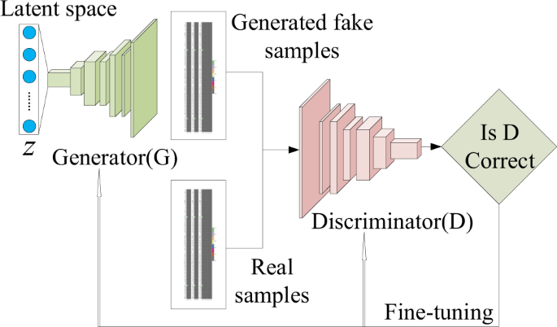

# VAE + GAN Minichallenge

In this minichallenge, we pre-train a VAE that is then used to train a GAN.

## Installation

conda create -n fml
conda activate fml
conda install pip
pip install -r requirements.txt

## VAE

The VAE (Variational Autoencoder) model encodes image data into latent space using convolutional layers. It uses 2D convolutional layers to progressively reduce the spatial dimensions of the input. Then, a decoder part is used with 2d deconvolutional layers to increase the spatial dimensions back to the original size. The interesting thing is that the model learns to generate images of the same style as the training data from random noise. The following picture shows the model architecture:

Mathematically, we want to maximize the likelihood of the data x (in the figure) given a parameterized probability distribution $p_\theta(x) = p(x|\theta)$. This distribution is usually chosen to be a Gaussian $N(x|\mu, \phi)$ which is parameterized by $\mu$ and $\phi$ respectively. This refers to the middle section in the image.

The probability of $p_\theta(x)$ can be found by integrating over the joint probability: $p_\theta(x) = \int_z p_\theta(x, z)dz$. "z" is the latent space encoded by the "probabilistic encoder" in the image. It is usually taken to be a finite-dimensional vector of real numbers. The term can be rewritten to $p_\theta(x) = \int_z p_\theta(x|z)p(z)dz$ with the chain rule ($P(A \cap B) = P(B | A) * P(A)$). This can be modeled with the VAE model and its architecture.  $p_\theta(x|z)$ is a Gaussian distribution. $p_\theta(x)$ is a mixture of Gaussian distributions. We can also say that $p_\theta(z)$ is the prior and $p_\theta(x|z)$ is the likelihood. Using the bayesian approach, we can define $p_\theta(z|x)$ as the posterior (z given input data x). Unfortunately, computation of $p_\theta(x)$ is expensive and it is therefore necessary to approximate the posterior distribution.

The approximation is the core of the encoder model in the VAE. The posterior distribution is approximated by the encoder which calcualtes an approximation $q_\phi(z|x)$. We can also call it a "probabilistic encoder". Similarly, the "probabilistic decoder" decodes the approximated z and calculates $p_\theta(x|z)$.

### Loss

The idea is to optimize the generative model parameters $\theta$ to reduce the reconstruction error between the input and the output (x &rarr; x'). We also want to optimize $\phi$ (approximated parameters to the true parameters $\theta$) to make the approximated posterior as close as possible to the true posterior. As reconstruction loss, MSE and cross entropy are often used. A good distance loss for two distributions (approximated posterior and true posterior) is the Kullback-Leibler divergence $D_{KL}(q_\phi(z|x) || p_\theta(z|x))$. We don't know the true posterior, we just make the model train on the Kullback-Leibler divergence approximating some kind of posterior function that is assumed to have mean = 0 and standard deviation = 1. This goal makes the approximated posterior by the VAE simpler. This also simplifies the KL divergence formula.

The full loss therefore uses not only a "reconstruction term", which tries to minimalize the reconstruction error between x &rarr; x', but also the $D_{KL}$. The full loss is:

$$
loss = ||x-x'||^2 + KL[N(\mu_x, \sigma_x), N(0, 1))] = ||x-d(z))||^2 + KL[N(\mu_x, \sigma_x), N(0, 1))]
$$

#### More on KL regularisation

Like in all machine learning models, there is a risk of overfitting. The KL regularisation term in the loss makes it so the mean and standard deviation to be 1 and the mean to be 0. This prevents encoded distributions to be too far apart from each others. It also prevents distributions to be too far apart in latent space. Two points in latent space should give two similar contents when decoded (continuity) and a point sampled from latent space should give meaningful content once decoded (completeness). Continuity means that small changes in the latent space correspond to small changes in the data space. This is desirable because it means that the model can generate smooth transitions between different data points. Completeness means that every point in the latent space corresponds to a meaningful data point. This is desirable because it means that the model can generate a wide variety of different data points.

By doing the regularisation like that, it helps to prevent overfitting by discouraging the model from learning to represent each data point with a unique point in the latent space (which would correspond to a "weird" distribution overfitted on the data).

### Decoding from latent space

First a latent representation z is sampled from the prior distribution $p(z)$. Then, the data x is sampled from the conditional likelihood distribution $p(x|z)$. Since we're working with sampling which is a stochastic process that involves randomness, we need a trick called "reparameterization" for backpropagation to work. The reparameterization trick is a clever solution to this problem. Instead of sampling from the distribution directly, we do the following:

$z[i] = mu[i] + sigma[i] * eps[i]$

Where mu and sigma are output vectors from the encoder and eps is a set of values that are sampled from a gaussian distribution. "eps" is ignored in the backpropagation. Now mu and sigma are differentiable. This operation is equivalent to sampling from a Gaussian distribution with mean mu and sigma, because it scales and shifts the standard normal distribution to have the desired mean and standard deviation from the two vectors.

### Matrix dimensions:

Input = image dimensions

encoder output = mu and sigma vectors both with dimensions [batch_size, latent_dim]

eps = [batch_size, latent_dim]

z = [batch_size, latent_dim]

Each element z[i] is computed as mu[i] + sigma[i] * eps[i]

### Limitations

- Due to the probabilistic approach, VAE could oversimplify the distribution of the latent variables since we assume its a standard normal distribution.
- The process of reconstruction can be seen as an averaging process over the likely values in the learned data distribution. Since there is a stochastic process involved, we will never get sharp images. While reconstructing, the VAE is considering a distribution of possible pixel values.
- VAEs lack control over specifics of the generated output. 
- Determining the dimensions of the latent space is challenging (hyperparameter). A small latent space might not capture all of the necessary information, while a large latent space might capture too much unnecessary detail.

## GAN

GANs (Generative Adversarial Network) generate new data with the same statistics as the training set similar to VAEs. They also have a decoder part just like the VAE but scratch the encoder part. Therefore they can't be used for data compression. GANs train two models simultaneously: a Discriminator and a Generator. The Generator generates an image and the Discriminator tries to guess whether it is a real example or not. The generator is therefore trained to fool the discriminator. This makes GANs produce sharper images than VAEs. GANs are similar to mimicry in evolutionary biology, with an evolutionary arms race between both networks. 

### Generator

To generate images for the discriminator, we sample some noise z using a normal or uniform distribution. With z as an input, we use a generator to create an image ($x=G(z)$). Like in the VAE, z is a latent space that gets convoluted up to a bigger size. 

### Discriminator

- Gans tend to generate sharper images compared to VAEs. This is due to its generatorxdiscriminator learning
- trainin

### Limitations
- Training can be unstable. Two networks are trained simultaneously. If one overpowers, it can lead to issues like mode collapse.
- Mode collapse = scenario where generator produces limited varieties of samples or even same sample regardless of input. 
- Can't be used as compression like VAE.
- Don't converge (Discriminator and Generator constantly battle one another)

## Data

Data is 8300 images of comic faces that are preprocessed to be 64x64. These images are very small to begin with.

## Problems

images are rectangles, but we preprocess them to be squared for the cnn

## Sources:
VAE: https://towardsdatascience.com/understanding-variational-autoencoders-vaes-f70510919f73
Wikipedia, ChatGPT
http://taylordenouden.com/VAE-Latent-Space-Explorer/
https://www.kaggle.com/datasets/arnaud58/landscape-pictures?resource=download&select=00000001_%282%29.jpg

GAN: https://jonathan-hui.medium.com/gan-whats-generative-adversarial-networks-and-its-application-f39ed278ef09